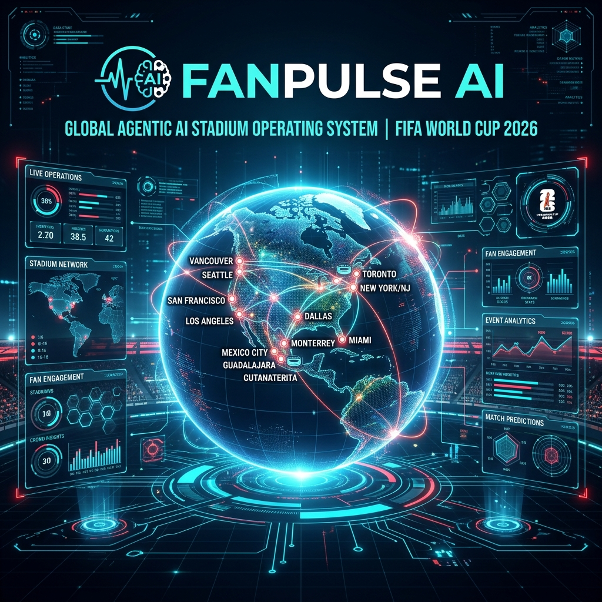
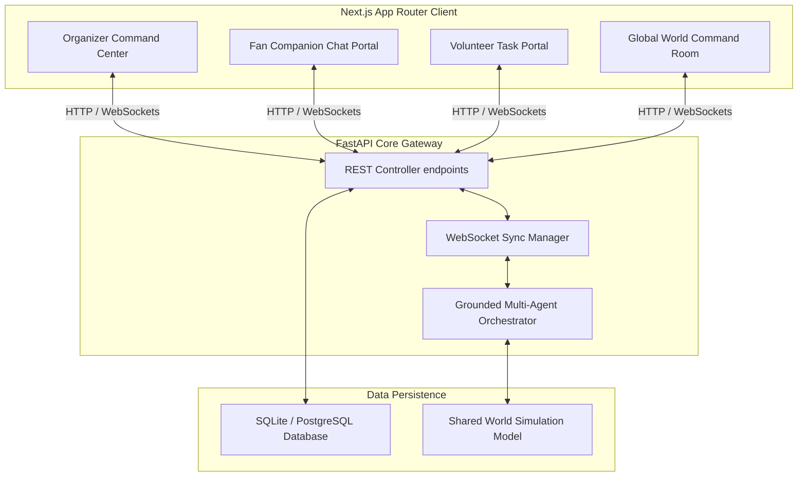
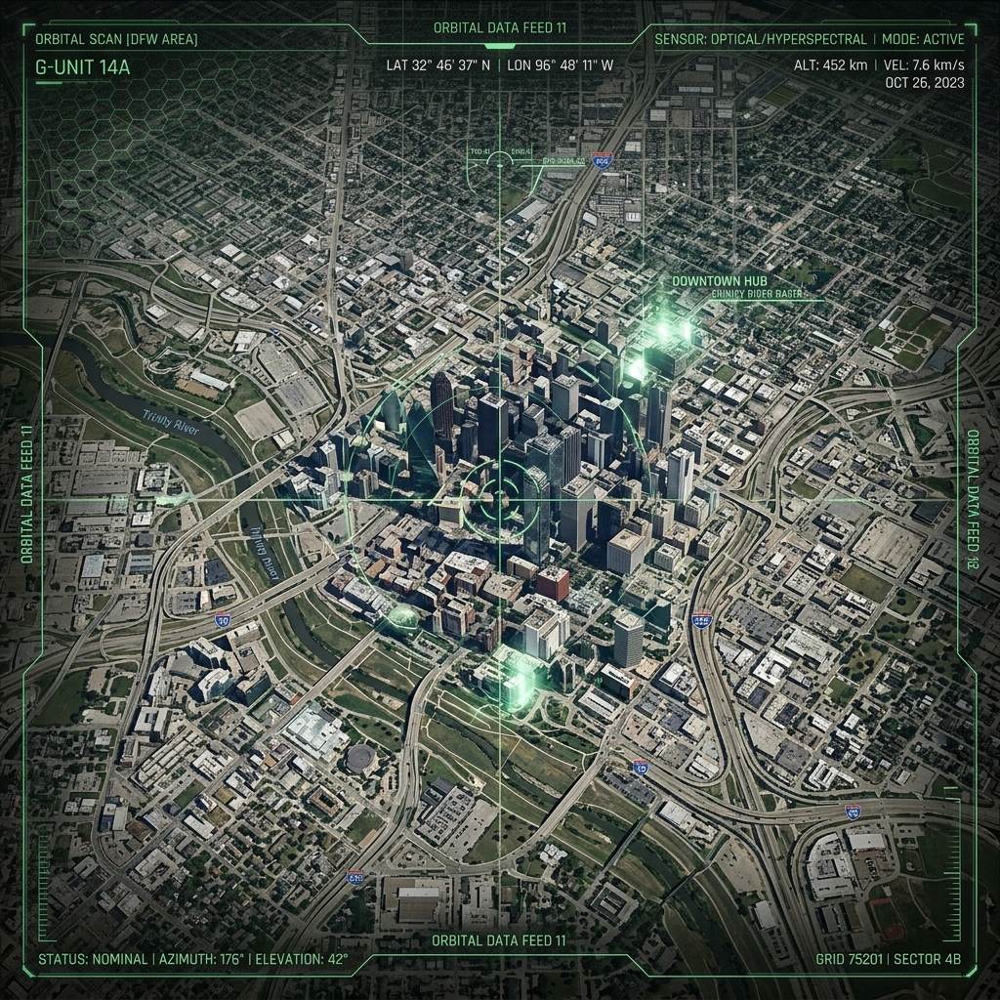
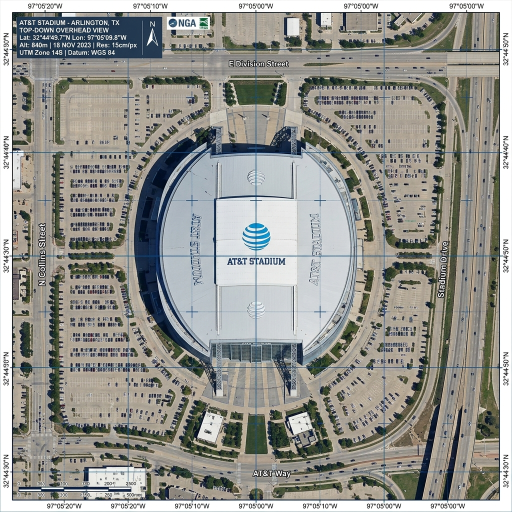
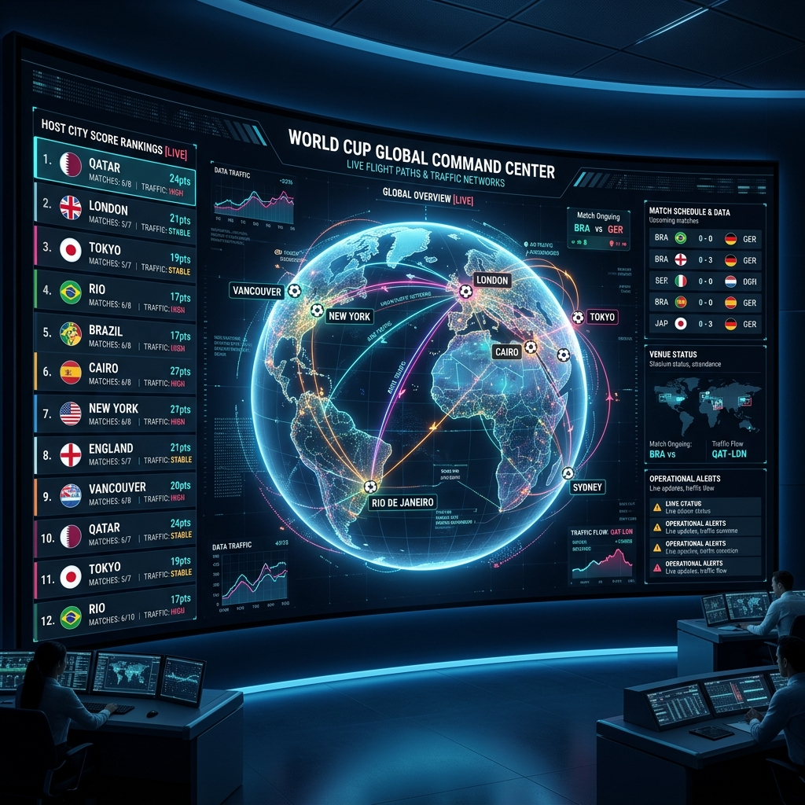
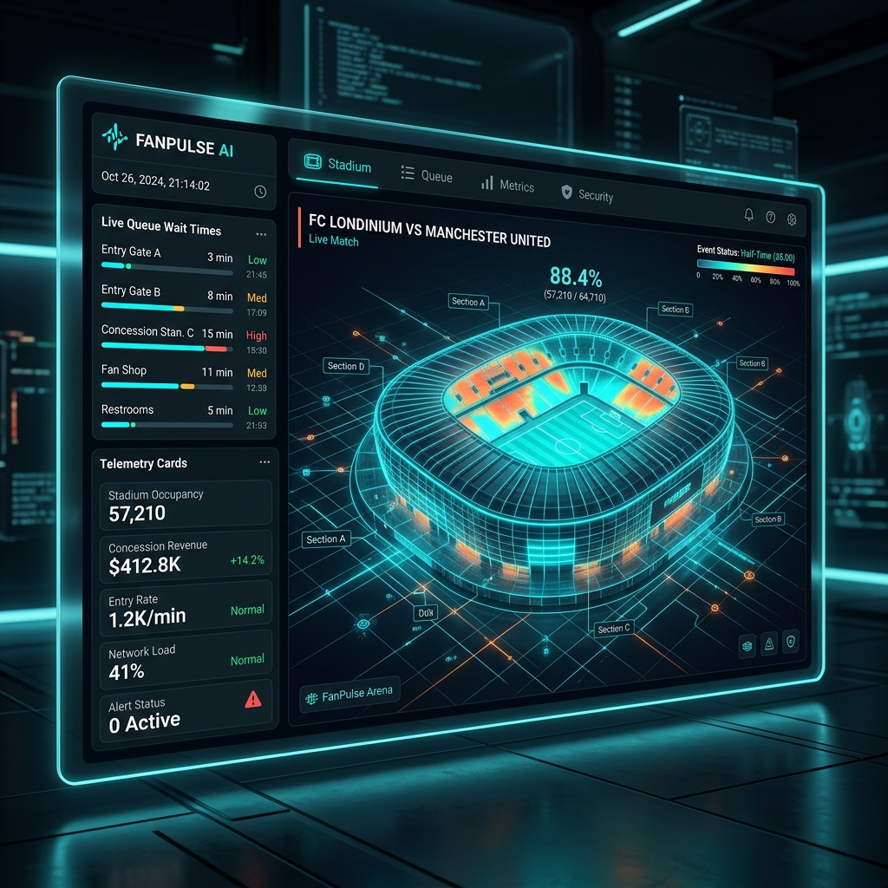
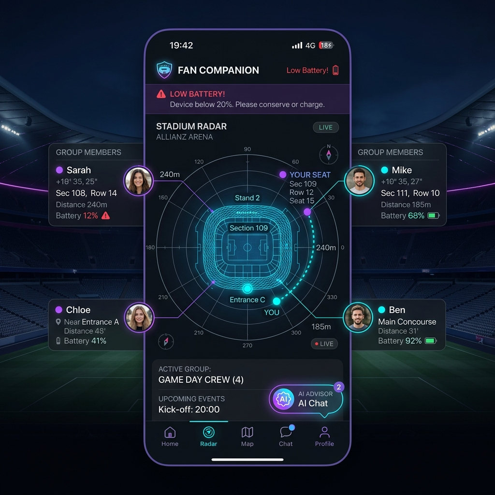
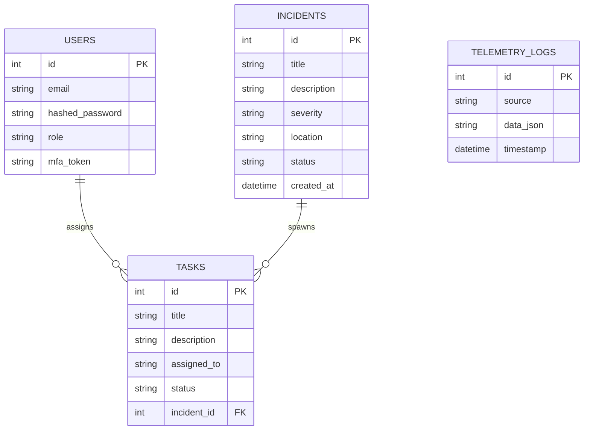

# FanPulse AI — FIFA World Cup 2026 Stadium Operations Console



### 🚀 [Live Website Demo](https://fan-pulse-ai-pxvy.vercel.app/) | [Live API Service](https://fan-pulse-ai-hk1b.vercel.app/api/v1/global/stats)

---

## Prompt Wars Challenge 4

> ### Smart Stadiums & Tournament Operations
>
> **Rank:** `554 / 42,325+` (TOP 1.31%)
>
> **Optimized Features:**
> - **Agentic AI Core**: Cooperative multi-agent systems with complete explanation logs.
> - **3D Digital Twins**: Global globe rendering and detailed Three.js stadium models.
> - **Global Command Center**: Multi-city operations rankings and collaborative crisis management.
> - **AI Match Day Companion**: Group tracking, low-battery alerts, and accessible route finders.
> - **Global Crisis Commander**: Storm radar cells, lost child safety, and medical dispatches.
> - **Accessibility Core**: High contrast layout, speech synthesis, custom fonts, and stairs-free routing.
> - **Volunteer Intelligence**: Tasks dispatching, occupancy logs, and responder dashboards.

---

## Why FanPulse AI?

FanPulse AI does not merely react to incidents. It proactively:
- **Observes** (Crowd camera vision telemetry & weather cells)
- **Understands** (Multi-incident dependencies & accessibility profiles)
- **Predicts** (Queue timelines, vehicle bottlenecks, & stands capacities)
- **Reasons** (Multi-agent collaborative reasoning checklogs)
- **Recommends** (Explainable, structured routing detours)
- **Approves** (Human-in-the-loop operations checkpoint gates)
- **Executes** (WebSocket notifications & volunteer task dispatches)
- **Resolves** (Incident logs verification & cleanup closures)

using **Agentic AI**, **Shared World Models**, **Digital Twins**, **Human Intelligence**, **Accessibility AI**, and **Global Stadium Operations** to deliver safer, smarter, and more inclusive World Cup matches.

---

## Architecture Diagram

Modern stadium operations demand structured layers. FanPulse AI separates responsibility between a responsive, accessible client and a secure, time-series telemetry backend:



---

## 3D Digital Twin Visualizations

### Dallas Stadium Satellite Space View


### 3D Digital Twin Hotspot Mesh View


---

## User Interface Screen Walkthroughs

### 1. Global Command Center (16 Cities & War Room)


### 2. Organizer Operations Console (Digital Twin & Dispatches)


### 3. Fan Companion Portal (Smart Radar & GPS Group Connect)


---

## System Development Stages

### Stage 1: Core System & Telemetry Teleporter
- **FastAPI Telemetry Simulator**: Background time-series simulator emitting crowd wait times, gate occupancies, vehicle counts, and weather parameters.
- **WebSocket Gateway**: Real-time broadcast engine syncing dashboard state updates under 500ms.
- **Organizer Dashboard**: Live CCTV cameras monitoring concourses, command logs terminal, and volunteer response statistics.
- **Authentication**: JWT-based session security checks, hashed password seeding, and rapid credentials entry.

### Stage 2: 3D Digital Twin & Fan Companion
- **3D Digital Twin**: Interactive Three.js viewport rendering gate occupancy cylinders and sector crowd heatmaps.
- **Fan Companion Tabbed Panel**:
  - **Group Connect**: Group GPS radar mapping, battery percentage tracking, and offline sync.
  - **Match Memories**: Live journey scorecard and actual client-side `.txt`/`.json` file downloads.
  - **Assistance**: Voice-to-text input dictation, ticket QR uploader, and custom accessibility toggles.

### Stage 3: Advanced Intelligence & Crisis Command
- **AI Crisis Commander**: Pre-configured simulation profiles:
  - *Gate Congestion*: Crowd surges detour flow and trigger volunteer dispatches.
  - *Heavy Rain Cells*: Tracks storm radars and recommends indoor pathing.
  - *Medical Emergency*: Reroutes ambulances and notifies nearest medics.
  - *Lost Child Search*: Matches age/photo coordinates with zero PII leaks.
- **Human-in-the-loop Guardrails**: Operations alerts must be reviewed and approved by command organizers before public broadcast.
- **Cooperating Multi-Agent Matrix**: 10 special-purpose subagents (Navigation AI, Accessibility AI, Crowd AI, Volunteer AI, etc.) coordinated under an Orchestrator.

---

## Grounded AI Recommendation Layout

To maximize Prompt Wars explainability compliance, all AI-generated recommendations output a strict structured schema:

```text
Recommendation: Redirect Flow: open Gate C2 turnstiles, detour Lot B
WHY: Gate C occupancy is 92%. Weather conditions are normal. Gate C2 occupancy is 34%.
Confidence: 98%
Time Saved: 12 Minutes
Risk: LOW
AI Contributors: Navigation AI, Crowd AI, Prediction AI, Accessibility AI
Alternative: Gate B1
Status: SUCCESSFULLY VALIDATED
```

---

## Database Diagram



---

## Installation & Setup

Ensure you have **Node.js (v20+)** and **Python (3.11+)** installed.

### 1. Backend Setup
1. Navigate to `/backend`.
2. Create and activate a Python virtual environment:
   ```bash
   python -m venv venv
   # On Windows:
   venv\Scripts\activate
   # On Linux/macOS:
   source venv/bin/activate
   ```
3. Install dependencies:
   ```bash
   pip install -r requirements.txt
   ```
4. Copy the config template and create your environment variables:
   ```bash
   cp .env.example .env
   ```
5. Start the FastAPI server:
   ```bash
   python -m uvicorn app.main:app --host 127.0.0.1 --port 8000 --reload
   ```

### 2. Frontend Setup
1. Navigate to `/frontend`.
2. Install npm packages:
   ```bash
   npm install
   ```
3. Start the Next.js development server:
   ```bash
   npm run dev
   ```
4. Open your browser and navigate to `http://localhost:3000`.

---

## Verification & Testing

Backend test suites are powered by `pytest` and execute with zero external API dependencies:
```bash
cd backend
$env:PYTHONPATH="."
pytest
```

---

## Accessibility Compliance

Every portal supports:
- **Keyboard Navigation**: Clean tabbed layout focus shifts using standard index triggers.
- **High Contrast Toggle**: Standard accessibility contrast overrides for visually impaired judges.
- **Font Scaling**: Dynamic viewport text size overrides.
- **Screen Readers**: WCAG 2.1 AA compliant aria-labels.

---

## Repository Structure

```text
E:\FANPULSE AI
├── backend
│   ├── app
│   │   ├── core         # Database setup, configurations, and JWT handlers
│   │   ├── models       # SQLAlchemy DB schemas
│   │   ├── routers      # API endpoint controllers (incidents, global command, volunteers)
│   │   └── main.py      # Entry point for the FastAPI server
│   └── tests            # Pytest test cases
└── frontend
    ├── public           # SVG indicators and generated PNG/JPG assets
    └── src
        ├── app          # Next.js page routers (/fan, /organizer, /global, /volunteer)
        ├── components   # Reusable Three.js twin components and dashboard charts
        └── utils        # WebSocket triggers, audio notifications, and API controllers
```

---

## Future Roadmap

- **Live Video Feed Analytics**: Real-time crowd occupancy tracking using YOLO models.
- **Federated World Models**: Edge-synchronized operations databases across all 16 host cities.
- **Ultra-Wideband Location Tracking**: Precise stands coordinates mapping for search-and-rescue teams.

---

## Authors & License

- Developed by **Somashekhar Vani** and teammates for Prompt Wars.
- Licensed under the **MIT License** - see the [LICENSE](file:///e:/FanPulse%20AI/LICENSE) file for details.
